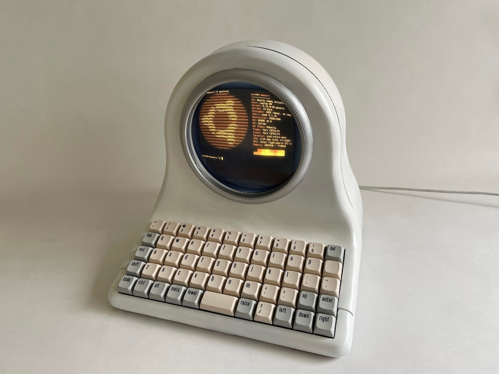
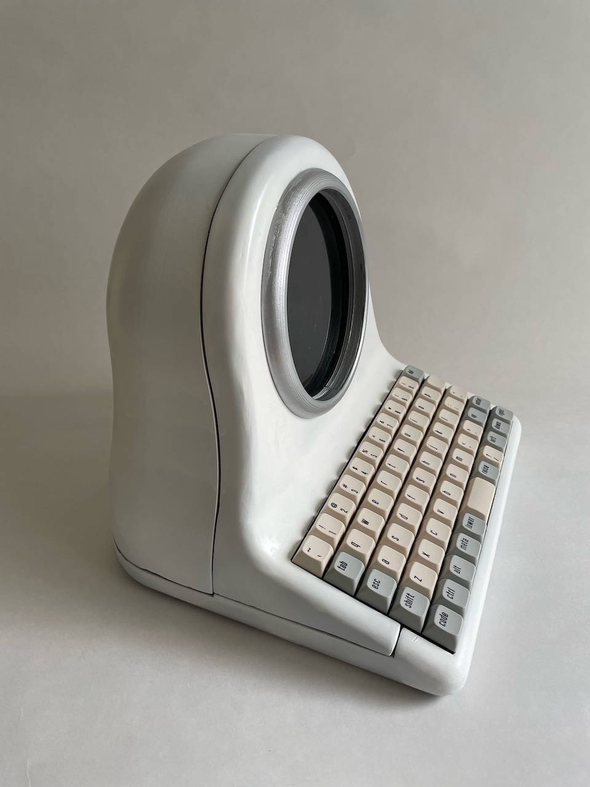
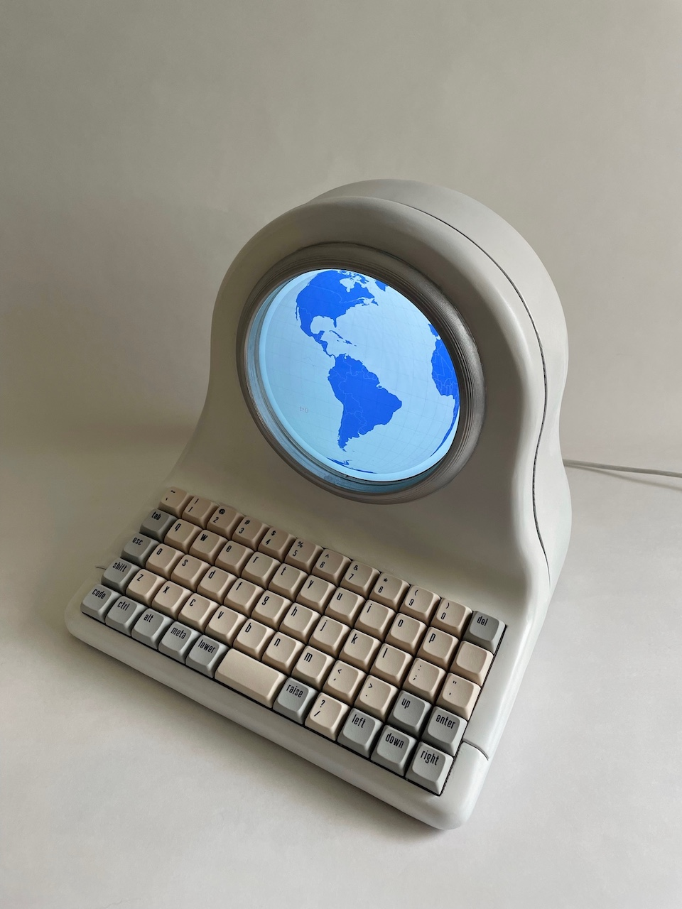
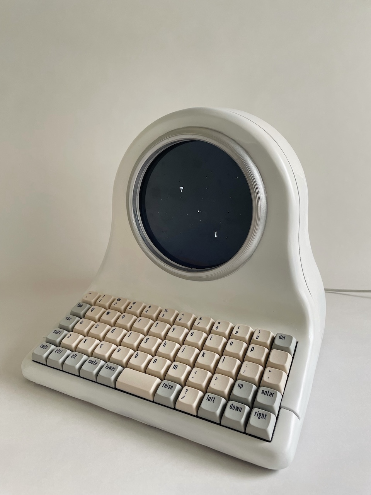
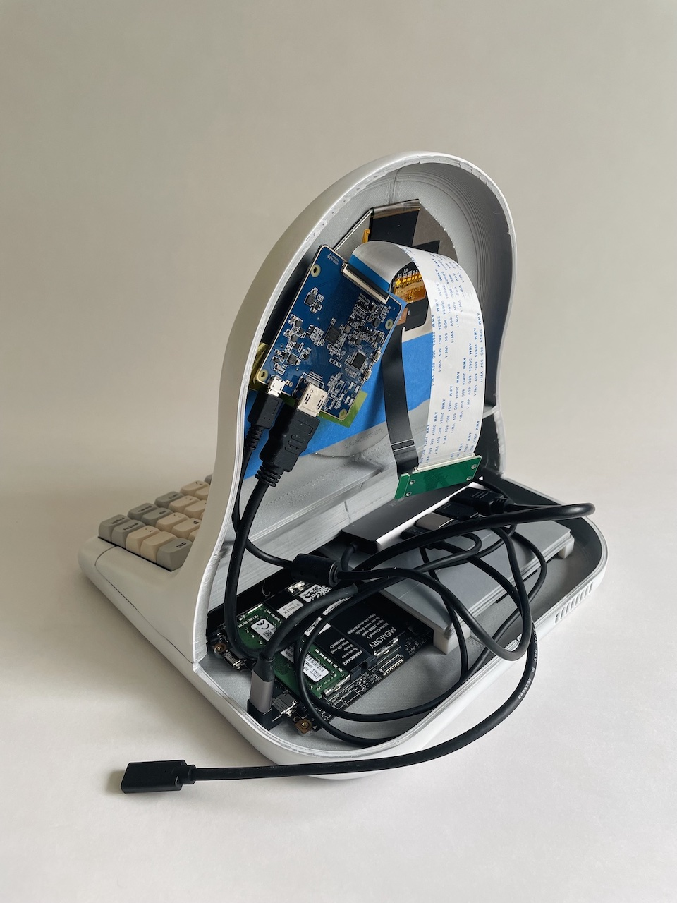
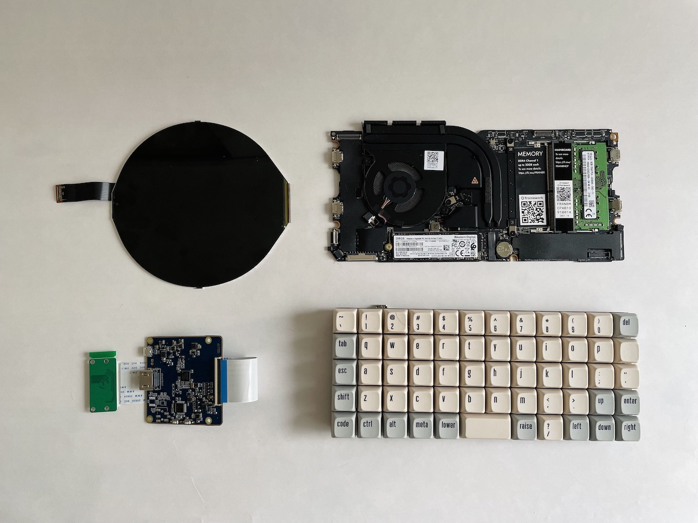
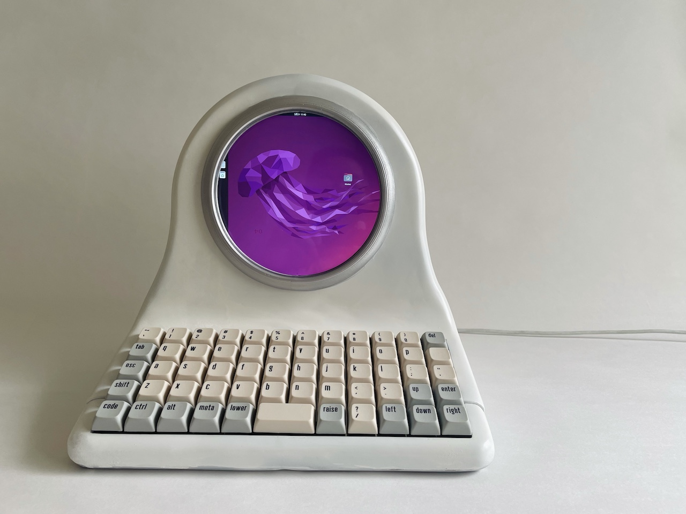
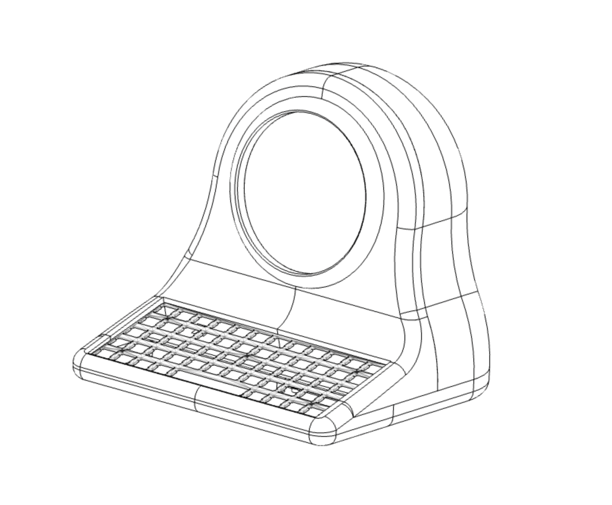
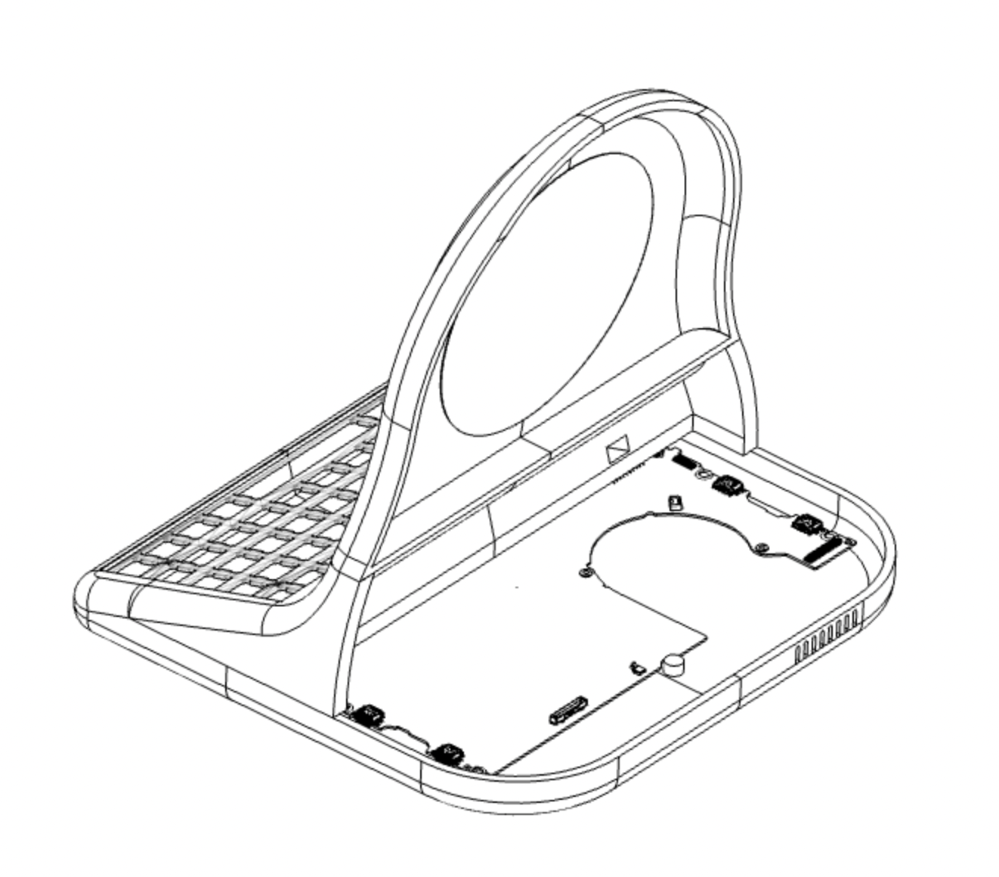
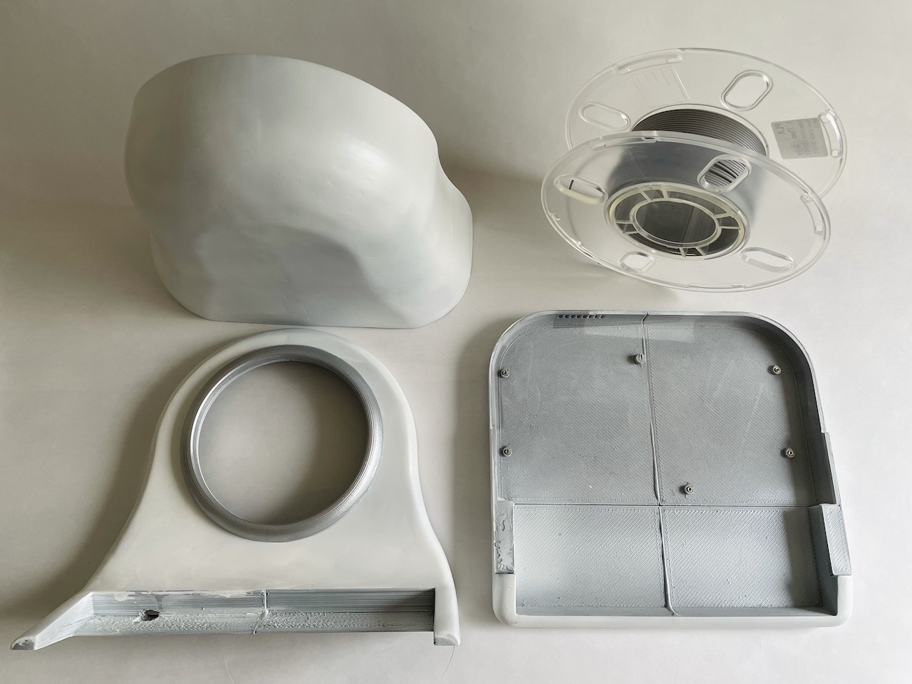

# Mainboard Terminal - A Retro-style Computer with a Modern Core

Mainboard Terminal is not just any cyberdeck, it's a full-feature PC powered by Framework's Mainboard. 
It has a 5" (1080x1080) round LCD, a fully 3D printable case, and is compatible with OLKB Preonic mechanical keyboard. 

## The Design 

I've always wanted a terminal with a round screen, with the Mainboard product and its [2D drawing released](https://github.com/FrameworkComputer/Mainboard), I finally had the chance to build one. 
And yes, it runs Spacewar! :-)

|  |  | 
|-----------------------------|-----------------------------|
|  |  |

### Electronics 

- Framework Mainboard [https://frame.work/products/mainboard](https://frame.work/products/mainboard) 
- OLKB Preonic [https://drop.com/buy/preonic-mechanical-keyboard](https://drop.com/buy/preonic-mechanical-keyboard) 
- 5" round LCD [https://m.tb.cn/h.fr5pE3w](https://m.tb.cn/h.fr5pE3w)

### Software 

Everything works out of the box with Ubuntu 22.04 LTS, which is nice. 

 

- Setting for the display 

        xrandr --newmode "1080x1080R" 82.50 1080 1128 1160 1240  1080 1083 1093 1111 +hsync -vsync
        xrandr --addmode DP-1 "1080x1080R"
        xrandr --output DP-1 --mode "1080x1080R"

- Patch `CoolRetroTerm` to increase screen curvature (optional, purely aesthetic reason) 

    Edit `app/qml/ApplicationSettings.qml` and change the following property: 

        readonly property real screenCurvatureSize: 2.0

### 3D Printed Parts

Everything is (loosely) held together with 5x2mm magnets in my build (again, for purely aesthetic reason). You might want to add holes for screws & other cutout to utilize those USB4 ports. 

|  | | 
|-----------------------------|-----------------------------|

- [STL files](model/STL)
- [Editable STEP file](model/Mainboard-Terminal.step)

Be sure to check out the [2D drawing](https://github.com/FrameworkComputer/Mainboard/tree/main/Mechanical/2D) released by Framework if you want to do further customization. 

Paint color used in the build: Tamiya paint `PS-57` (Pearl White) and `TS-30` (Silver Leaf). 

## Copyright and License

Copyright (c) 2022 Penk Chen. All rights reserved.

All files are licensed under MIT license, see the [LICENSE](LICENSE) for more information.